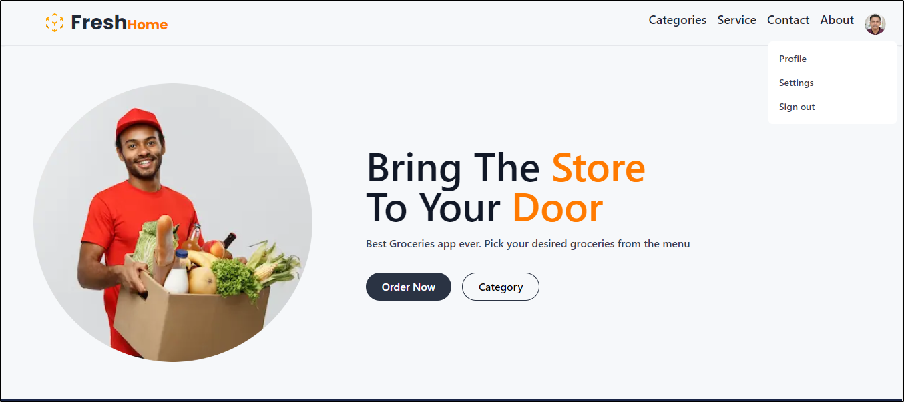

# Fresh Home Ecommerce Web Application



## Getting Started

#### This is an ecommerce web application built with Next.js, TypeScript, MongoDB, Prisma, and Tailwind CSS, framer-Motion. The application allows users to browse products, add products to a shopping cart, checkout their orders and track their orders.

## Installation

#### To run the application locally, follow these steps:

1.  clone the repository

```bash
git clone https://github.com/shyamenk/FreshHome.git
```

2. Install the dependencies.

```bash
cd FreshHome
npm install
```

3. Set up the environment variables.
   - Copy the .env.sample file to .env and fill in the required values.

```bash
cp .env.sample .env
```

1. Start the development server.

```bash
npm run dev
```

### The application should now be running on http://localhost:3000.

## Features

- Browse products: Users can view a list of products and click on a product to
  view its details.

- Add to cart: Users can add a product to their shopping cart by clicking on the
  "Add to Cart" button.

- View cart: Users can view the contents of their shopping cart, remove items
  from the cart, and adjust the quantity of items.

- Checkout: Users can checkout their order by providing their shipping and
  payment details.

- Authentication: Users can sign up and log in to their account to view their
  order history and save their shipping and payment details for future orders.

## Tech Stack

- [Next.js:](https://nextjs.org/) A React-based web framework for building
  server-side rendered (SSR) and static websites.

- [TypeScript](https://www.typescriptlang.org/) A superset of JavaScript that
  adds static typing and other language features.

- [MongoDB](https://www.mongodb.com/cloud/atlas/register) A NoSQL database for
  storing data.

- [Prisma](https://www.prisma.io/docs/getting-started) A database ORM
  (Object-Relational Mapping) tool for interacting with the database.

- [Tailwind CSS](https://tailwindcss.com/docs/installation) A utility-first CSS
  framework for styling web applications.
